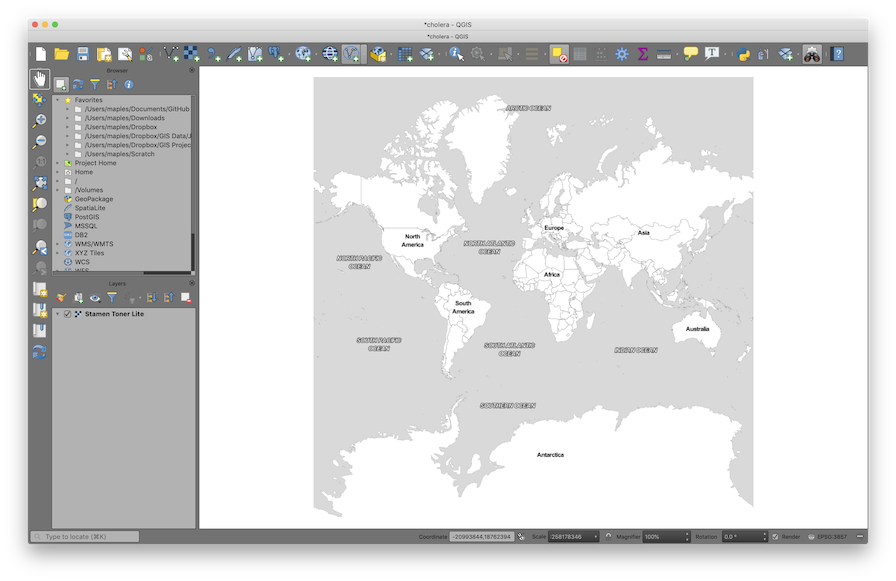
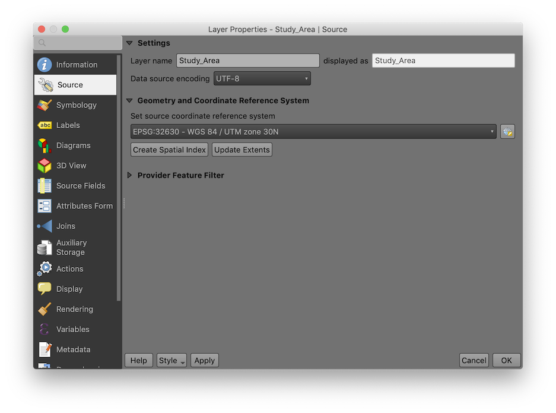
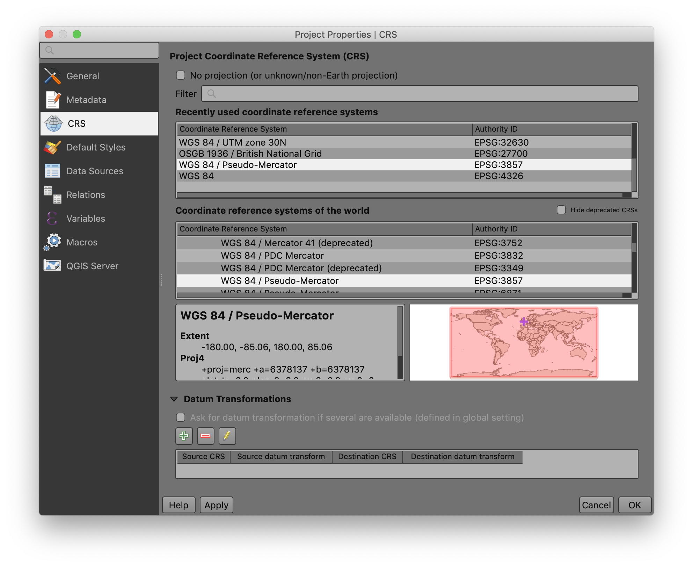
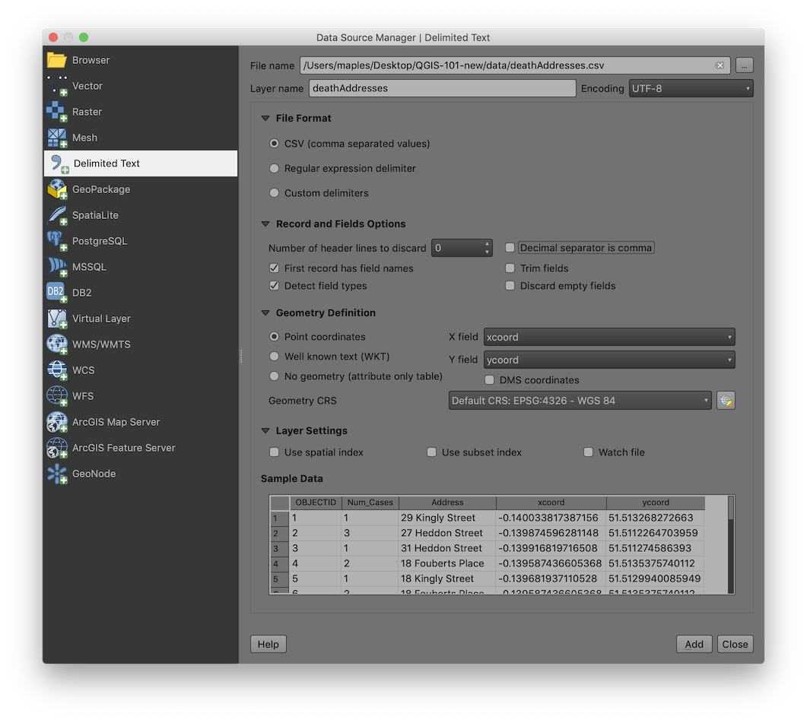
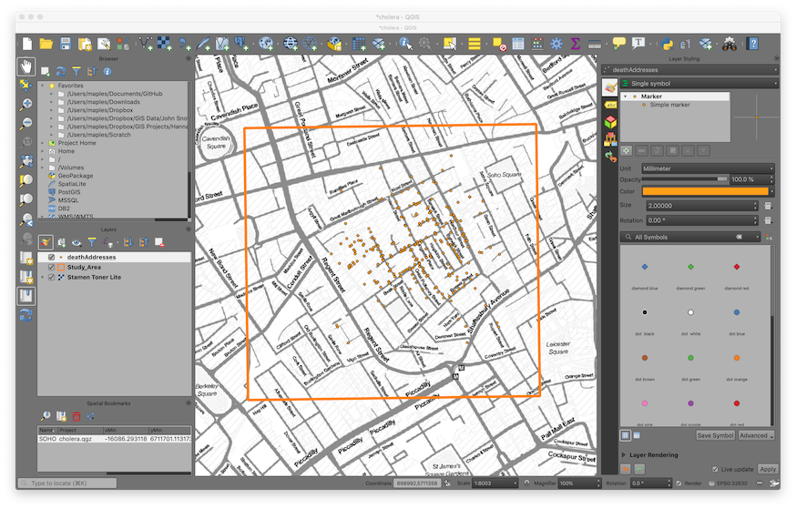

# QGIS 101

This document outlines the basic structure of the Introductory 101s workshops, part of the SGC Spatial Data Workshop Series. 

## Overview

This workshop aims to accomplish two things: Introduce participants to basic vocabulary, concepts and techniques for working with spatial data in research and introduce the interface and tools in QGIS, a free & open source desktop GIS software

## Setup

```addcontent```

### Software

`Overview and Installation & Setup Guidance for the Packages covered will be presented here.`  

### Data

```update```

The data package for the workshop can be downloaded from <here>

* deathAddresses.csv  
* John_Snow_Map.tif
* Study_Area.shp
* Water_Pumps.geojson

## Getting started on a project  

In this section we will cover starting a new QGIS project. We will create a new map document, go over the basic QGIS interface, customize that interface, add a plug-in and bring a base map into your QGIS project.

### Create a Map Document

1. To create a new map document, simply open QGIS and save the resulting empty document to your project folder, naming your new document something meaningful like "SnowMap.qgz" or "Cholera_Map.qgz"

### Interface overview

The QGIS interface is similar to many desktop GIS applications. 

#### The Basic Components of the QGIS Interface

The QGIS interface is made up of three basic components:

**The Map Canvas **– the map canvas is where your visualizations of data will show up when you had a new data layer. This is where you will view the changes that are made when you adjust symbology, when you change the order of layers, or when you produce a new data set through geo-processing  

**Tabbed Windows:**

* **The Browser Window** – Functions much as Explorer does in Windows. In this window, you can visualize your drives and folders. Is the equivalent of ArcCatalog in ArcMap.
* **The Layers Window** – This is where your added geographic and non-geographic datasets will show. This is similar to the Table of Contents in ArcMap.

**General Menu Bars:**

* **File Bar** – Has the basic commands of any file: New, Open, Save, Save As. The New Print Composer and Composer Manager are to create and manage layout views.
* **Map Navigation** – Allows the user to Pan, Zoom to a Selected Feature, Zoom In, Zoom Out, Zoom to previous/next extent, and Refresh.
* **Attributes** – These tools allow the user to: Identify attributes, Select / Deselect features, Opens attribute table, measure distance/areas/angles, create spatial bookmarks.
* **Plugins** – QGIS comes with two default plugins: Python Console and QGis 2 Leaflet Webmap.
* **Help** – The question mark booklet is linked to the QGIS User Guide.
* **Manage Layers** – This bar is to add layers (vector, raster, new shapefile layer)

### Customize interface

When you first open QGIS, you might find the toolbars and panels that are neabled by default are more than your project calls for. Most panels and toolbars in the QGIS interface can be moved around by grabbing the title bar of panels, or the dotted handle on toolbars, and dragging them to the desired location in the interface. You can also use the View menu to turn panels and toobars on and off.


1. Toggle the visibility and move toolbars and panels until your QGIS interface resembles the image below.


### Add a plugin
The first thing we would like to do is at a base map layer to our map project. We will use the quick map services plug-in to add a base map created by Stamen design. QGIS uses a plug-in model to extend the functionality of the basic software. Most plug-ins are contributed by members of the QGIS community and many extend functionality by adding interactivity with external services like geocoding , routing, and base map services.

1. On the **Main menu** of **QGIS**, find the **Plug-ins** menu and open the **Manage and install plugins** dialogue.  
2. In the search box at the top of the dialogue, search for the term "QuickMapServices"    
3. The search should return a plug-in called "QuickMapServices." 
4. Click on the QuickMapServices plug-in name and then click the install plug-in button
5. Once the plug-in has successfully installed, Close the plug-in management dialog.

  

### Add a basemap service layer

1. Installing the **QuickMapServices** plug-in should have added a new menu item to the QGIS main menu called "Web".
2. Click on the web menu and from the **QuickMapServices** item select "**Settings**."
3. Select the "**More Services**" tab and click on the "**Get contributed pack**" button. This will download a large list of web map services that can be used directly into GIS as base maps.  
  
4. Once the contributed pack has been downloaded click **Save** to close the dialog.
5. Now return to the quick map services menu, and select the **Stamen> Stamen Toner Lite** base map.



### Add an existing data layer
Now we're going to add an existing data layer. The data layer that we will add describes our area of interest in this study. This layer Will provide us with a convenient way to orient our data frame to the area that we are interested in as well as providing a way to limit the processing extent of certain geo-processing tools.

1. In the **QGIS Browser panel**, find the data folder for this workshop (Hint: look for the "**Project Home**" folder)a nd double-click on the **study_area.shp** file, to add it to your **map project**.
2. In the **Layers panel**, right-click on the **study_area layer** and select "**Zoom to layer**."
3. On the **Main menu**, enable the **Layer styling panel** from the **Layer>Panels menu**. 
4. In the **Layer styling panel** select **Simple fill** from the panel at the top, and change the **Fill style** to "**No brush**." If you would like you can also change the **Stroke color** & **Stroke width** of the stroke to make it more visible against the black-and-white basemap.
5. **Save** your **map document**.


### Explore navigation tools

Now we will explore the **basic navigation tools** in QGIS. These are the tools that you will 

The **Map Navigation Toolbar** provides the bulk of the tools for navigation in
the **Map Canvas**. Most of them are fairly obvious. Take a moment to explore
each of these tools, and how it works.

  The **Touch Zoom and Pan** - Works if you have a notebook with touch screen.
Zoom in and zoom out using double finger touch.

  The **Pan Map** changes the Extent of Map Canvas, without changing the scale.
Click on the Pan Tool and use it to move around the Map Canvas.

  The **Pan Map to Selection** changes the Extent of your Map Canvas to the
feature being selected, without changing the scale

  The **Zoom In Tool** and    **Zoom Out** works exactly as you would expect. Click on the Zoom Tool, and drag
a box to enclose the Continental United States. You can also single-click with
this tool to use it as a Fixed Zoom Tools.

  The **Zoom Full** zooms you to the full extent of the layer in your Map Project with the largest spatial extent. This can sometimes be problematic if you are
working at a local level, but using one or more layers that are global in extent
(for example, many of the network base map services).

  The **Zoom to Selection** changes the Extent of your Map Canvas and zooms in or
out to the selected feature.

### Scale

When zooming in or out, the Scale Values at the bottom page change. Remember
that the bigger the number (1:60,000,000), the larger the area being displayed.
Although 60,000,000 is bigger than 60, a scale 1:60,000,000 is a small scale and
1:60 is a large scale because the division of 1/60,000,000 is smaller than 1/60.


  The **Zoom to Layer** to a specific layer extent.

  The **Zoom Last** and  **Zoom Next** works as a Redo or Undo tool **ONLY** for the Scale/Extent in your Map Canvas. This tool is particularly useful if you change your Map Extent inadvertently.

  The **Refresh Button** will reload your Map Extent

### Spatial Bookmarks

Often, we want to be able to move around in our data frame examining different parts of the map zooming in and out, and then returning to our primary area of interest. This can be easily accommodated through the use of spatial bookmarks. Here you'll create a spatial bookmark which allows us to quickly return to the area that we are interested in.

1. Previously we used the main menu to enable a panel. This time, try right-clicking in any empty area of the toolbar then scroll down and select the **Spatial Bookmarks panel** from the menu that is presented.
2. Right-click on your study_area layer and select **Zoom to layer**.
3. Click on the Add Bookmark button and rename the resulting Spatial Bookmark: "SOHO"  

4. Click on the **Zoom Full** button to zoom to the world, then use the **Zoom to bookmark **button to return to your Area of Interest.

### Working with CRS
Examine the Default CRS (web merc) change to UTM
#### Examine the CRS of a data layer
1. Right-click on the study area layer select the layer ∫ from the menu.
2. Click on the source tab on the left side of the properties panel, and note in the section called Geometry and Coordinate reference system that the CRS of this layer is:  

```EPSG:32630 WGS 84 / UTM zone 30N```  


3. Click OK to close the Layer Properties Dialog  
4. On the main menu Open the Project Properties from the Project menu.  
5. Click on the CRS tab at the left and note that the project is in a projection called:  

```EPSG:3857 WGS 84 Pseudo-Mercator```   

*This is the projection of the basemap and is the default for the project because the basemap was the first layer that we added to the project.*  



#### Change the Project CRS  
1. Locate the CRS of the **Study_Area** layer in the "**Recently used coordinate reference systems**" section, or type the EPSG code "**32630**" into the Filter box at the top of the **Properties** dialog.  

2. Click on the ```EPSG:32630 WGS 84 / UTM zone 30N``` and then click OK to change the CRS of teh Project to teh same as the layer **Study_Area**.
3. Save your changes by clicking on the Save button  on the Project toolbar.  

### Create a data layer from an XY table?
Add the deathAddresses.csv 

1. Click on the **Add Delimited Text Layer** button to open the Data Source Manager dialog.
2. For **File Name**, browse to the **data** folder and select the **deathAddresses.csv**
3. Set the remainder of the settings as follows, and click **Add & Close** to import the layer:    

| setting | value |
|--------------------------:|--------------------------------------------------------------------|
| File Format:  | CSV |
| Record and Field Options: | "First records has field names" = true "Detect field types" = true |
| Geometry Definition: | Point coordinates: "X field" = 'xcoord, "Y field" = 'ycoord' |   


  



### Layer symbology
Proportional symbols on Death Addresses

1. If not already, **click** on the **deathAddresses** layer to highlight it and focus the **Layer Styling panel** on this layer.
2. Change teh Symology Type dropdown to "**Graduated**"
3. Select **Num_Cases**


### Statistics on a field
Num Cases

## Creating spatial data from a scanned reference source map
### Finding a map

* earthworks.stanford.edu
* DavidRumsey.com
* OldMapsOnline.com

[Gegend von London 1853](https://www.davidrumsey.com/luna/servlet/detail/RUMSEY~8~1~298861~90066747:Gegend-von-London-1853?sort=Pub_List_No_InitialSort%2CPub_Date%2CPub_List_No%2CSeries_No&qvq=w4s:/where%2FLondon%2B%252528England%252529%2Fwhen%2F1854;q:london%201854;sort:Pub_List_No_InitialSort%2CPub_Date%2CPub_List_No%2CSeries_No;lc:RUMSEY~8~1&mi=1&trs=2)

### Adding a DavidRumsey.com map to QGIS

```http
https://maps.georeferencer.com/georeferences/435516159934/2019-02-19T17:27:12.514288Z/wmts?key=mpIMvCWIYHCcIzNaqUSo&SERVICE=WMTS&REQUEST=GetCapabilities
```   

### Georeference a map

Georeference the John Snow 1854 SOHO map for digitizing the water pump locations.

### Digitize features from a georeferenced map
### Labels

## Exploration and basic analysis of spatial point patterns
### Spatial Allocation with Thiessen polygons (using/controlling geoprocessing tools)
### Spatial Joins
### Summary Statistics cased
### Spatial mean & standard distance
### Hotspot mapping using spatial interpolation

## Creating a map layout

### More Symbology
### Customizing page options
### Adding a Legend
### Adding a Table
### Adding a Scalebar
### Adding text (citations)
### Adding a Neatline
### Export options and formats

