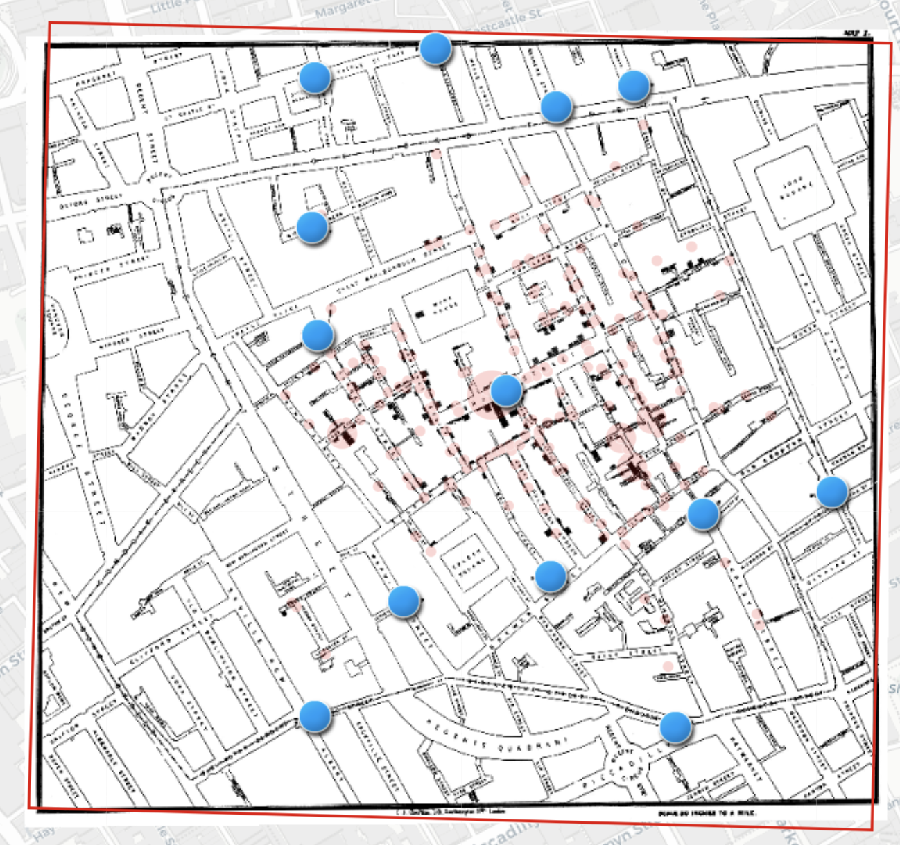

# QGIS 101 Instructor Script

## Overview

### GIS Resource links:  

## Setup

### Software
https://qgis.org/en/site/forusers/download.html

### Data
https://github.com/mapninja/QGIS-101/archive/master.zip

The project data folder contains the following datasets:

#### Additional Files

## Getting started on a project  

create and save as SnowMap

### Interface overview

Canvas
Panels
Toolbars

### Customize  interface

Rearrange things

### Add a plugin

Quickmaps, and add contributed package from settings

### Add a basemap service layer

Add the  Stamen stamenbasemap

### Add an existing data layer

Add the  Study Layer data

### Explore navigation tools

show zoom  and pan, etc...

### Scale

Highlight scale displayed

### Spatial Bookmarks

Create a SOHO bookmark at teh  extent of the  study area layer

### Working with CRS
 Examine the CRS of a data layer

 Examine the CRS of projected

 Set Project CRS to study  area layers

 ### Create a data layer from an XY table?

 Use Delimited Text tool to add deathAddresses to Canvas

 ### Layer symbology

 Proportional Symbol on Num_Cases

 #### Bonus: Adding Drop Shadows

 defaults

 ### Viewing the Attribute Table

 sort on Num_Cases

 ### Statistics on a field  

 Vector > Analysis Tools > Basic Statistics for Fields

 ### Finding a map
We'll start by looking at this map [[Gegend von London 1853](https://www.davidrumsey.com/luna/servlet/detail/RUMSEY~8~1~298861~90066747:Gegend-von-London-1853?sort=Pub_List_No_InitialSort%2CPub_Date%2CPub_List_No%2CSeries_No&qvq=w4s:/where%2FLondon%2B%252528England%252529%2Fwhen%2F1854;q:london%201854;sort:Pub_List_No_InitialSort%2CPub_Date%2CPub_List_No%2CSeries_No;lc:RUMSEY~8~1&mi=1&trs=2)] of London on [https://davidrumsey.com](https://davidrumsey.com)


### Add a map service

WMTS Link

```http
https://maps.georeferencer.com/georeferences/435516159934/2019-02-19T17:27:12.514288Z/wmts?key=mpIMvCWIYHCcIzNaqUSo&SERVICE=WMTS&REQUEST=GetCapabilities
```
### Georeference a map  

snow_map.png

### Digitize features from a georeferenced map

Create a point shapefile called water_pumps.shp with Label fields

### Symbolize for template

### Add points to your shapefile



### Labels

make labels with halos

### Projecting data

Export to EPSG:32630 for Analysis

### Copying Symbologies

Copy and  Paste to new layer

## Basic spatial data analysis

### Voronoi (Thiessen) polygon (Spatial Allocation)

50% Buffer

### Spatial Join (Point Aggregation)
Vector \> Data Management Tools \> Join attributes by location

Join Deaths to Voronoi as shapefile for attribute types

### Summary Statistics

Install  Group  Stats

Columns = States
Rows = Labels
Value = Num_Cases

Show sorting and export

## Basic Measures of Spatial Central Tendency

### Spatial Mean (Mean Center)

Basic, weighted and cased

### Standard Distance

Search for point pattern Analysis and  run on

### Creating a surface from Point Data to Highlight “Hotspots”


#### Kernel Density (Currently problematic)

Note: Project your DeathAddresses data to the EPSG:32630 UTM coordinate system, before running the  next steps. Some changes have been made to the QGIS interface and how it interacts with some of the processing libraries included

Use built in tools
